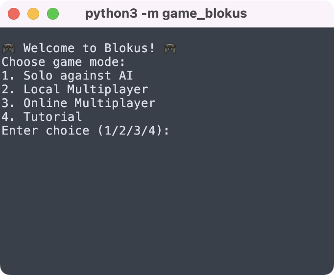
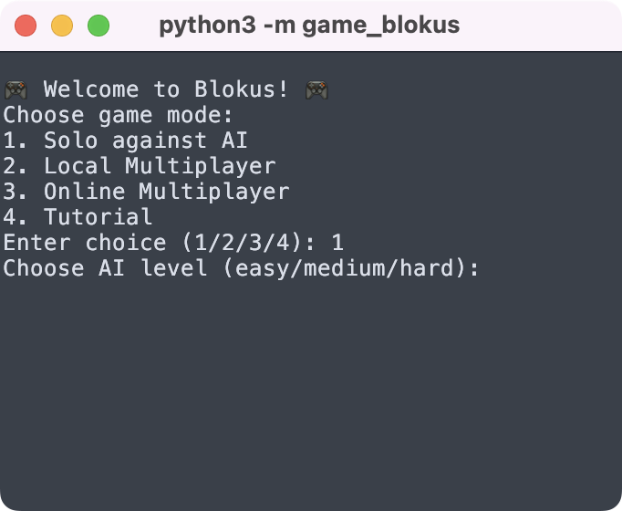
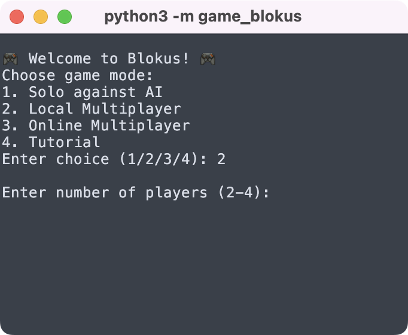
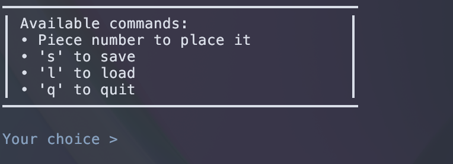
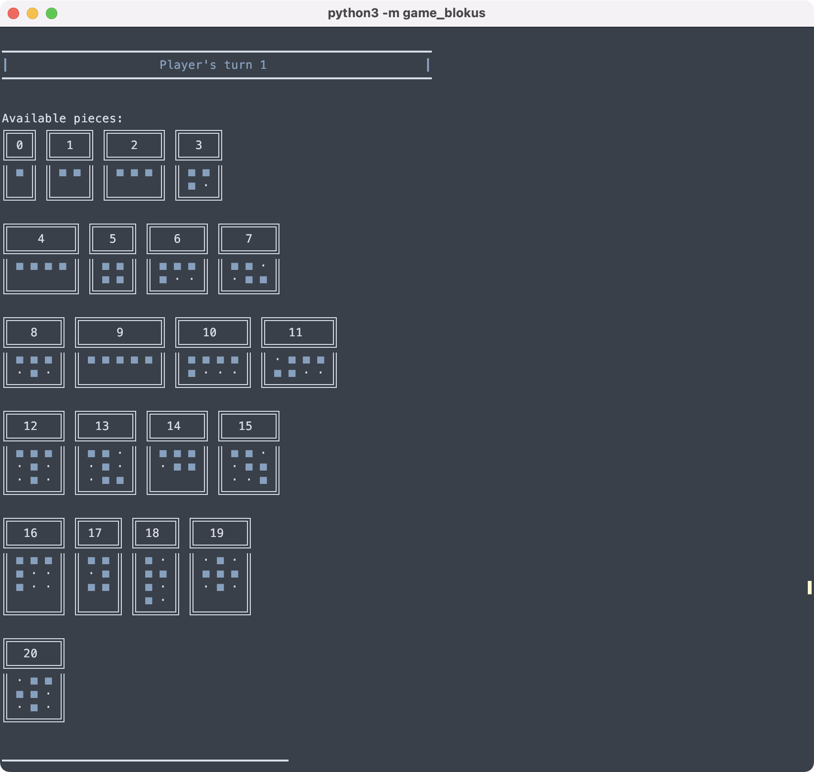

# Manuel d'Utilisation de l'Application Blokus

---

## Introduction

Blokus est un jeu de stratégie où les joueurs placent des pièces sur un plateau de jeu. Ce manuel vous guidera à travers les fonctionnalités et les règles du jeu une fois l'application lancée.

---

## Modes de Jeu

### Solo contre l'IA

- **Choix du Niveau** : Sélectionnez le niveau de difficulté (`easy`, `medium`, `hard`).

### Multijoueur Local

- **Nombre de Joueurs** : Entrez le nombre de joueurs (2-4).

### Multijoueur en Ligne

*Il est nécessaire pour cette partie d'exécuter `server.sh` (dev only)*

- **Créer une Partie** : Générer un ID de partie et le partager avec les autres joueurs.
- **Rejoindre une Partie** : Entrez l'ID de la partie fournie par l'hôte.

### Tutoriel

- **Apprentissage** : Suivez les instructions pour comprendre les règles et les stratégies du jeu.

---

## Commandes du Jeu

- **Sauvegarder** : `s`
- **Charger** : `l`
- **Afficher l'Aide** : `h`
- **Quitter** : `q`

---

## Placement des Pièces

### Sélection de la Pièce

- **Numéro de la Pièce** : Entrez le numéro de la pièce (0-20).

### Placement de la Pièce

1. **Coordonnées** : Entrez les coordonnées de la colonne (x) et de la ligne (y). Il faut placer le point qui est le carré le plus en haut à gauche de la pièce, les rotations se font après.
2. **Rotation** : Choisissez la rotation (0-3) pour des rotations de 90° dans le sens des aiguilles d'une montre.
3. **Retourner** : Choisissez si vous voulez retourner la pièce (y/n).
4. **Confirmation** : Confirmez le placement après la prévisualisation.

### Aide pour voir les moves possibles

1. **Afficher les Possibilités** : Affiche les coordonnées possibles pour placer la pièce. (**Attention ce mode d'aide ne prend pas en compte les rotations, il ne s'agit que d'une aide au placement**), appuyez sur la touche `enter` afin de voir les autres placements possibles.

---

## Règles du Jeu

1. **Coin à Coin** : Chaque pièce doit être placée coin à coin avec vos pièces existantes.
2. **Pas de Bord à Bord** : Les pièces ne peuvent pas partager de bord avec vos autres pièces.
3. **Première Pièce** : La première pièce doit toucher un coin du plateau.
4. **Fin de Partie** : Le jeu se termine lorsque plus aucun joueur ne peut placer de pièces.

---

## Stratégies

1. **Grandes Pièces en Premier** : Utilisez les plus grandes pièces au début pour maximiser vos options plus tard.
2. **Contrôle des Coins** : Essayez de contrôler les coins du plateau pour augmenter vos options de placement.
3. **Blocage des Adversaires** : Placez vos pièces de manière stratégique pour limiter les mouvements des autres joueurs.

---

## Sauvegarde et Chargement

- **Sauvegarder** : Utilisez la commande `s` pour sauvegarder l'état actuel du jeu dans un fichier.
- **Charger** : Utilisez la commande `l` pour charger une partie sauvegardée.

---

## Fin de Partie

Il est possible de quitter le jeu dans le menu de sélection des pièces en appuyant sur `q`.

Le jeu se termine lorsque plus aucun joueur ne peut placer de pièces. Le joueur avec le moins de carrés non placés gagne.

---

En suivant ce manuel, vous devriez être en mesure de configurer et de jouer à Blokus sans problème. Bon jeu !